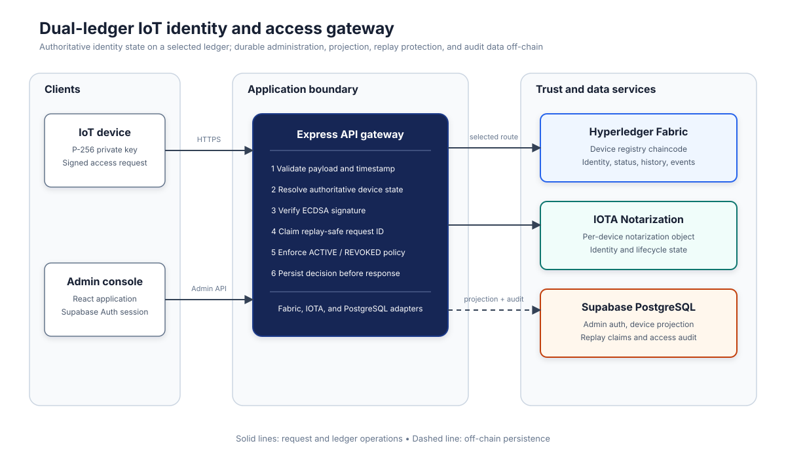

# Dual-Ledger IoT Identity and Access Gateway

A production-oriented identity and access management gateway for IoT fleets. Devices authenticate requests with ECDSA P-256 signatures, administrators manage device state through a secured React console, and authorization policy can be backed by Hyperledger Fabric or IOTA Dynamic Notarization.

The gateway keeps detailed request data off-chain in Supabase PostgreSQL while using the selected ledger as the authoritative source for device identity and `ACTIVE` or `REVOKED` status.

## Highlights

- ECDSA P-256 device authentication over `device_id:action:timestamp`
- Five-minute timestamp freshness window with future-clock tolerance
- Persistent replay prevention through deterministic request IDs
- Runtime routing between Hyperledger Fabric and IOTA
- Fail-closed authorization when the selected ledger is unavailable
- Supabase Auth with admin-role enforcement for management APIs
- Durable access auditing, device projections, and operational telemetry
- React 19 administration console and Python device simulator

## Architecture



### Request Flow

1. A device signs `device_id:action:timestamp` with its P-256 private key.
2. The Express gateway validates the payload, timestamp, rate limit, and signature.
3. The selected ledger adapter resolves the device public key and status.
4. The gateway rejects unknown, invalid, replayed, or revoked requests.
5. The request ID and decision are persisted to `access_logs` before success is returned.
6. The admin console reads live state and can register, revoke, activate, rotate, or delete devices.

## Technology

| Layer | Technology | Responsibility |
| --- | --- | --- |
| Admin console | React 19, Vite 8, Chart.js | Authentication, fleet operations, route selection, and telemetry |
| API gateway | Node.js 20+, Express 5 | Signature verification, authorization, routing, and audit coordination |
| Permissioned ledger | Hyperledger Fabric 2.5, Fabric Gateway SDK | Device registry, status policy, events, and history |
| Public ledger | IOTA SDK, IOTA Notarization | Per-device Dynamic Notarization objects and state transitions |
| Data and auth | Supabase PostgreSQL, Supabase Auth | Admin sessions, device projection, audit logs, and replay claims |
| Device tooling | Python, `cryptography` | P-256 key generation and signed traffic simulation |

## Repository Layout

```text
.
|-- chaincode/device-registry/   Hyperledger Fabric smart contract
|-- docs/architecture.svg        System architecture diagram
|-- fabric-samples/              Upstream Fabric samples submodule
|-- frontend/                    React administration console
|-- scripts/                     Fabric deployment and IOTA publishing tools
|-- fabric-client.js             Fabric Gateway adapter
|-- gateway.js                   Express API gateway
|-- iot_simulator.py             Signed IoT device simulator
|-- iota-client.js               IOTA Notarization adapter
|-- supabase-db.js               PostgreSQL persistence adapter
|-- supabase-schema.sql          Database schema and RLS configuration
|-- .env.example                 Backend configuration template
`-- start-all.bat                Windows development launcher
```

## Prerequisites

### Core

- Node.js 20 or newer
- npm 10 or newer
- Python 3.8 or newer
- A Supabase project

### Hyperledger Fabric Mode

- Docker Engine or Docker Desktop with Compose v2
- WSL2 on Windows, or a Linux environment
- Go and the Fabric 2.5 binaries

### IOTA Mode

- Rust toolchain
- IOTA CLI 1.14
- Testnet tokens for package publishing and transactions

## Installation

Clone the repository with its Fabric submodule:

```bash
git clone --recurse-submodules https://github.com/Arnavl115/IoT-IAM.git
cd IoT-IAM
```

If the repository is already cloned:

```bash
git submodule update --init --recursive
```

Install each application workspace:

```bash
npm ci
npm --prefix frontend ci
npm --prefix chaincode/device-registry ci
python -m pip install -r requirements.txt
```

## Configuration

Create local configuration files from the committed templates:

```bash
cp .env.example .env
cp frontend/.env.example frontend/.env
```

Never commit `.env`, service-role credentials, simulator private keys, IOTA signer keys, or generated ledger registries.

### Backend Variables

| Variable | Required | Description |
| --- | --- | --- |
| `PORT` | No | Gateway port; defaults to `3000` |
| `NODE_ENV` | Yes in production | Set to `production` to enable production security behavior |
| `FRONTEND_URL` | Yes | Allowed browser origin; use the exact deployed console origin |
| `SUPABASE_URL` | Recommended | Supabase project URL |
| `SUPABASE_SERVICE_ROLE_KEY` | Recommended | Server-only database credential |
| `SUPABASE_JWT_SECRET` | Conditional | HS256 fallback for Supabase access-token verification |
| `FABRIC_ENABLED` | No | Enables the Fabric adapter when set to `true` |
| `CHANNEL_NAME` | Fabric | Fabric channel; defaults to `mychannel` |
| `CHAINCODE_NAME` | Fabric | Chaincode name; defaults to `deviceregistry` |
| `MSP_ID` | Fabric | Gateway identity MSP; defaults to `Org1MSP` |
| `FABRIC_IDENTITY` | Fabric | Enrolled Fabric identity name |
| `CRYPTO_PATH` | Fabric | Organization crypto-material directory |
| `PEER_ENDPOINT` | Fabric | Fabric peer gRPC endpoint |
| `PEER_HOST_ALIAS` | Fabric | TLS hostname for the peer certificate |
| `IOTA_ENABLED` | No | Enables the IOTA adapter when set to `true` |
| `IOTA_NODE_URL` | IOTA | IOTA JSON-RPC endpoint |
| `IOTA_FAUCET_URL` | IOTA | Testnet faucet endpoint |
| `IOTA_NOTARIZATION_PKG_ID` | IOTA | Published Notarization Move package ID |
| `IOTA_PRIVATE_KEY` | No | Stable Ed25519 signer; otherwise a local ignored key is generated |
| `SEED_DEMO_DEVICES` | No | Local-only seed switch; keep `false` in production |

The simulator additionally accepts `SUPABASE_ANON_KEY` and either `SIMULATOR_ACCESS_TOKEN` or `SIMULATOR_EMAIL` plus `SIMULATOR_PASSWORD`.

### Frontend Variables

| Variable | Description |
| --- | --- |
| `VITE_GATEWAY_URL` | Public URL of the Express gateway |
| `VITE_SUPABASE_URL` | Supabase project URL |
| `VITE_SUPABASE_ANON_KEY` | Public Supabase anonymous key |

## Database Setup

1. Create a Supabase project.
2. Open the SQL editor and execute `supabase-schema.sql`.
3. Create an Auth user for the administration console.
4. Set the user's server-controlled `app_metadata.role` to `admin`.
5. Configure the backend service-role key only in the server environment.

The schema creates `devices` and `access_logs`, enables row-level security, and uses the request ID primary key as a persistent replay claim.

## Run Locally

Start the gateway:

```bash
node gateway.js
```

Start the administration console in a second terminal:

```bash
npm --prefix frontend run dev
```

Optionally run the device simulator:

```bash
python iot_simulator.py
```

On Windows, `start-all.bat` launches the gateway and frontend together. The console is available at `http://localhost:5173`, the gateway at `http://localhost:3000`, and health information at `http://localhost:3000/health`.

When neither ledger is enabled, the gateway uses Supabase PostgreSQL when configured and otherwise uses in-memory state. This mode is useful for local integration only; deploy at least one authoritative ledger for production authorization.

## Hyperledger Fabric

Deploy the local test network and device registry chaincode from Linux or WSL2:

```bash
bash scripts/deploy-fabric.sh
```

The script starts `mychannel`, deploys `deviceregistry`, and verifies the Org1 peer. Configure these values before restarting the gateway:

```env
FABRIC_ENABLED=true
CHANNEL_NAME=mychannel
CHAINCODE_NAME=deviceregistry
MSP_ID=Org1MSP
FABRIC_IDENTITY=Admin@org1.example.com
CRYPTO_PATH=./fabric-samples/test-network/organizations/peerOrganizations/org1.example.com
PEER_ENDPOINT=localhost:7051
PEER_HOST_ALIAS=peer0.org1.example.com
```

The contract supports registration, lookup, key rotation, activation, revocation, toggling, deletion, listing, and device history. Registry mutations require an Org1 administrator identity and emit chaincode events.

## IOTA

Install the CLI and publish the Notarization Move package:

```bash
cargo install iota --version 1.14.0 --locked
bash scripts/publish-iota-package.sh
```

Add the resulting package ID to `.env` and enable the adapter:

```env
IOTA_ENABLED=true
IOTA_NODE_URL=https://api.testnet.iota.cafe
IOTA_FAUCET_URL=https://faucet.testnet.iota.cafe
IOTA_NOTARIZATION_PKG_ID=0xYOUR_PUBLISHED_PACKAGE_ID
```

The gateway creates one updatable, destroyable notarization object per device. Generated signer and object-registry files are local runtime state and are excluded from Git.

## API

### Public Device Endpoint

`POST /api/access`

```json
{
  "device_id": "sensor-001",
  "action": "read:temperature",
  "timestamp": 1788864000000,
  "signature": "BASE64_DER_ECDSA_SIGNATURE"
}
```

The signature is calculated over the UTF-8 string `device_id:action:timestamp`. Responses distinguish malformed input, invalid authentication, revoked devices, rate limiting, and unavailable ledger state.

### Administration Endpoints

All `/api/*` endpoints below require `Authorization: Bearer <supabase-access-token>` from an administrator, except `/api/access`.

| Method | Path | Purpose |
| --- | --- | --- |
| `GET` | `/health` | Service status, selected route, active backend, and enabled routes |
| `GET` | `/api/state` | Dashboard snapshot with devices, logs, telemetry, and backend state |
| `GET` | `/api/devices` | List registered devices |
| `GET` | `/api/logs?limit=100&offset=0` | Read paginated audit history |
| `POST` | `/api/route` | Select `FABRIC` or `IOTA` at runtime |
| `POST` | `/api/devices/register` | Register a device and canonical P-256 public key |
| `POST` | `/api/devices/toggle` | Toggle `ACTIVE` and `REVOKED` status |
| `POST` | `/api/devices/revoke` | Revoke a device |
| `POST` | `/api/devices/activate` | Activate a device |
| `POST` | `/api/devices/update-key` | Rotate a device public key |
| `DELETE` | `/api/devices/:id` | Delete a device |
| `POST` | `/api/stress` | Start the dashboard's short measurement window |

## Security Model

- Device IDs are restricted to 3-64 alphanumeric, underscore, or hyphen characters.
- Public keys must be canonical SPKI PEM keys on the P-256 curve.
- Signatures use SHA-256 and are checked only after timestamp validation.
- Stale requests and requests more than 30 seconds in the future are rejected.
- Duplicate request hashes are rejected across restarts when PostgreSQL is configured.
- Device authorization fails closed if the selected ledger cannot be reached.
- Management routes require a valid Supabase token and `app_metadata.role = "admin"`.
- The service-role key is accepted only by the backend and must never be exposed to Vite.
- Production deployments restrict CORS to `FRONTEND_URL` and should terminate HTTPS at a trusted reverse proxy.
- IOTA private keys, Fabric enrollment keys, `.env` files, logs, and simulator keys are excluded from source control.

## Verification

Run the checks used by this repository:

```bash
npm test
npm run lint
npm run test:frontend
npm --prefix chaincode/device-registry run lint
```

Build the production console directly with:

```bash
npm --prefix frontend run build
```

## Production Checklist

- [ ] Set `NODE_ENV=production` and an exact HTTPS `FRONTEND_URL`.
- [ ] Run `supabase-schema.sql` and provision an admin user.
- [ ] Store all backend secrets in a managed secret store.
- [ ] Enable and verify at least one authoritative ledger.
- [ ] Confirm `/health` reports the expected `activeRoute` and `activeBackend`.
- [ ] Build and serve `frontend/dist` behind HTTPS.
- [ ] Put the gateway behind a TLS reverse proxy and restrict network access.
- [ ] Register real device P-256 public keys; do not enable demo seeding.
- [ ] Exercise valid, invalid-signature, stale, replayed, and revoked request paths.
- [ ] Configure database backups, monitoring, and key-rotation procedures.

## License

The root Node.js package is licensed under ISC. The Fabric chaincode package is licensed under Apache-2.0. The `fabric-samples` submodule retains its upstream licenses.
